# MACHINE LEARNING-BASED PREDICTION AND OPTIMIZATION OF EMERGING CONTAMINANTS' ADSORPTION CAPACITY ON BIOCHAR MATERIALS

---

<div align="center">

*Project Report submitted to*
*[Your University Name]*
*for The Award of The Degree*
*of*

**Bachelor of Technology / Master of Technology**
**[Your Department Name]**

*by*

**[Your Full Name] ([Enrollment No.])**

Under the supervision of

**[Supervisor Name]**
**[Designation]**
**[Department, Institution]**

&nbsp;

**[DEPARTMENT NAME]**
**[INSTITUTION NAME]**
**May – 2026**

</div>

---

---

## DEDICATION

I dedicate this project to my Project Supervisor, [Supervisor Name], [Designation], [Department], [Institution], whose invaluable guidance, unwavering support, and profound knowledge have been instrumental in the successful completion of this work. Their insightful feedback, patience, and encouragement have significantly contributed to the quality and depth of this project.

I also extend my gratitude to all the faculty members of the department for their continuous support and contributions to my professional development.

I am also grateful to all those individuals who have, in any way, guided and supported me throughout the completion of this project.

---

---

## APPROVAL SHEET

This project entitled **"Machine Learning-Based Prediction and Optimization of Emerging Contaminants' Adsorption Capacity on Biochar Materials"** by **[Your Full Name] ([Enrollment No.])**, is approved for the degree of Bachelor/Master of Technology in [Department Name], [Institution Name], India.

&nbsp;

**Examiners**

\_\_\_\_\_\_\_\_\_\_\_\_\_\_\_\_\_\_\_\_\_\_\_\_\_

\_\_\_\_\_\_\_\_\_\_\_\_\_\_\_\_\_\_\_\_\_\_\_\_\_

\_\_\_\_\_\_\_\_\_\_\_\_\_\_\_\_\_\_\_\_\_\_\_\_\_

&nbsp;

**Supervisor**

\_\_\_\_\_\_\_\_\_\_\_\_\_\_\_\_\_\_\_\_\_\_\_\_\_

&nbsp;

**Chairman**

\_\_\_\_\_\_\_\_\_\_\_\_\_\_\_\_\_\_\_\_\_\_\_\_\_

&nbsp;

Date: \_\_\_\_\_\_\_\_\_\_\_\_\_\_\_\_\_\_\_\_

Place: \_\_\_\_\_\_\_\_\_\_\_\_\_\_\_\_\_\_\_\_

---

---

## DECLARATION

I declare that this written submission represents my ideas in my own words and where others' ideas or words have been included, I have adequately cited and referenced the original sources. I also declare that I have adhered to all principles of academic honesty and integrity and have not misrepresented or fabricated or falsified any idea/data/fact/source in my submission. I understand that any violation of the above will be cause for disciplinary action by the Institute and can also evoke penal action from the sources which have thus not been properly cited or from whom proper permission has not been taken when needed.

&nbsp;

\_\_\_\_\_\_\_\_\_\_\_\_\_\_\_\_\_\_\_\_\_\_\_\_\_\_\_\_\_\_\_\_\_\_

**[Your Full Name]**
Enrollment No: **[Enrollment No.]**

&nbsp;

Date: 13th May, 2026

---

---

## CERTIFICATE

It is certified that the work contained in the project entitled **"Machine Learning-Based Prediction and Optimization of Emerging Contaminants' Adsorption Capacity on Biochar Materials"** by **[Your Full Name] ([Enrollment No.])** has been carried out under my supervision and that this work has not been submitted elsewhere for a degree.

&nbsp;

&nbsp;

&nbsp;

<div align="right">

\_\_\_\_\_\_\_\_\_\_\_\_\_\_\_\_\_\_\_\_\_\_\_\_\_

**[Supervisor Name]**
**[Designation]**
**[Department]**
**[Institution]**
May – 2026

</div>

---

---

## PREFACE

This project report presents a comprehensive study on the development, evaluation, and deployment of machine learning (ML) models for the prediction and optimization of adsorption capacity of emerging contaminants (ECs) on biochar-based adsorbent materials. The work encompasses two complementary phases: a broad multi-algorithm comparison study conducted on a large literature-derived dataset, and a focused per-biochar modelling pipeline designed to generate material-specific predictive tools and process optimization recommendations.

The rapid proliferation of emerging contaminants — including pharmaceuticals, personal care products, pesticides, and industrial chemicals — in aquatic environments has emerged as a major environmental and public health concern. Conventional wastewater treatment technologies exhibit limited efficacy in removing trace-level ECs, thereby necessitating the development of advanced, cost-effective remediation strategies. Adsorption using biochar-derived materials has gained considerable attention owing to its high surface area, tunable porosity, and operational flexibility. However, the systematic experimental mapping of adsorption capacity across diverse materials and operating conditions is both time-intensive and resource-demanding.

Machine learning offers a transformative approach to this challenge by enabling data-driven prediction of adsorption capacity directly from input features, bypassing the need for exhaustive laboratory screening. In this work, a dataset comprising 3,757 experimentally reported adsorption data points was compiled and utilized to train, evaluate, and compare ten state-of-the-art ML algorithms. The CatBoost model was identified as the best performer, achieving a test coefficient of determination (R²) of 0.9433. SHAP (SHapley Additive exPlanations) analysis was subsequently applied to quantify and interpret the contribution of individual feature groups to model predictions.

In the second phase, a structured per-biochar modelling pipeline was developed for three specific adsorbent materials — Powdered Activated Carbon (PAC), biochar produced at 600 °C (PB600), and NaOH-activated sugarcane waste biochars (NaOH-SCW) — employing Gaussian Process Regression (GPR), Support Vector Regression (SVR), and Artificial Neural Networks (ANN). Genetic Algorithm (GA) optimization was further applied to identify the operating conditions that maximize adsorption capacity for each material. The developed models were integrated into an interactive Streamlit web application for accessible, real-time prediction.

The findings of this work demonstrate the strong predictive capability of ensemble tree-based models on comprehensive adsorption datasets, and highlight the distinct optimal operating regimes for the three selected biochar materials. This study contributes to the growing field of ML-assisted environmental engineering and provides actionable insights for the design and optimization of biochar-based adsorption systems for EC removal.

---

---

## ACKNOWLEDGEMENT

I would like to express my sincere gratitude to all those who have supported and encouraged me throughout the course of this project.

I am deeply indebted to my supervisor, [Supervisor Name], for their continuous guidance, valuable insights, and constant motivation. Their constructive advice, patience, and encouragement have been instrumental in shaping this work and ensuring its successful completion. It has been an honour to work under their supervision.

I also extend my heartfelt thanks to the faculty members of the [Department Name] for their support, academic inputs, and encouragement. I am equally grateful to the [Head of Department / Director] and the institution for providing the necessary computational facilities and a conducive research environment, without which this work would not have been possible.

I further acknowledge the authors of the original research — Zeeshan Haider Jaffari, Heewon Jeong, Jaegwan Shin, Jinwoo Kwak, Changgil Son, Yong-Gu Lee, Sangwon Kim, Kangmin Chon, and Kyung Hwa Cho (WEIL Group, UNIST, South Korea) — for making their dataset publicly available, which forms the empirical foundation of this project.

&nbsp;

<div align="right">

Regards,
[Your Full Name] ([Enrollment No.])

</div>

---

---

## LIST OF FIGURES

| **Fig. No.** | **Figure Title** | **Page** |
|:---|:---|:---:|
| Fig. 1 | Feature distributions of five operational input variables across PAC, PB600, and NaOH-SCW biochars | 19 |
| Fig. 2 | Cross-biochar comparison of test R² for GPR, SVR, and ANN models (Phase 2) | 21 |
| Fig. 3 | Predicted vs Actual adsorption capacity — PAC (GPR, SVR, and ANN; blue = train, red = test) | 25 |
| Fig. 4 | Residual error distribution histograms — PAC (GPR, SVR, and ANN) | 25 |
| Fig. 5 | Violin plots of observed vs predicted adsorption capacity — PAC | 26 |
| Fig. 6 | ANN training and validation loss curves — PAC | 26 |
| Fig. 7 | Predicted vs Actual adsorption capacity — PB600 (GPR, SVR, and ANN) | 29 |
| Fig. 8 | Residual error distribution histograms — PB600 (GPR, SVR, and ANN) | 30 |
| Fig. 9 | Violin plots of observed vs predicted adsorption capacity — PB600 | 30 |
| Fig. 10 | ANN training and validation loss curves — PB600 | 31 |
| Fig. 11 | Predicted vs Actual adsorption capacity — NaOH-SCW (GPR, SVR, and ANN) | 33 |
| Fig. 12 | Residual error distribution histograms — NaOH-SCW (GPR, SVR, and ANN) | 33 |
| Fig. 13 | Violin plots of observed vs predicted adsorption capacity — NaOH-SCW | 34 |
| Fig. 14 | ANN training and validation loss curves — NaOH-SCW | 34 |
| Fig. 15 | R² comparison line plot across all three biochars and three models | 36 |
| Fig. 16 | Violin error comparison across models and biochars | 37 |
| Fig. 17 | Combined performance dashboard — all biochars and models | 37 |
| Fig. 18 | Genetic Algorithm convergence curve — PAC (best fitness vs. generation) | 40 |
| Fig. 19 | Genetic Algorithm convergence curve — PB600 (best fitness vs. generation) | 41 |
| Fig. 20 | Genetic Algorithm convergence curve — NaOH-SCW (best fitness vs. generation) | 41 |

---

---

## LIST OF TABLES

| **Table No.** | **Table Title** | **Page** |
|:---|:---|:---:|
| Table 1 | Input features used in the machine learning models | 12 |
| Table 2 | Dataset statistics for the three selected biochar materials | 14 |
| Table 3 | Summary of ten ML algorithms evaluated in Phase 1 | 19 |
| Table 4 | Phase 1 model performance comparison (test R² and MAE) | 21 |
| Table 5 | SHAP feature group importance for CatBoost model | 23 |
| Table 6 | GPR kernel configuration | 24 |
| Table 7 | SVR hyperparameter search grid | 25 |
| Table 8 | ANN architecture and training configuration | 25 |
| Table 9 | GA optimization parameters | 26 |
| Table 10 | Phase 2 model performance — PAC | 24 |
| Table 11 | Phase 2 model performance — PB600 | 28 |
| Table 12 | Phase 2 model performance — NaOH-SCW | 32 |
| Table 13 | Cross-biochar best model summary | 35 |
| Table 14 | GA-optimized conditions and predicted maximum adsorption capacity — all biochars | 39 |

---

---

## NOMENCLATURE

| **Symbol / Abbreviation** | **Description** |
|:---|:---|
| EC | Emerging Contaminant |
| ML | Machine Learning |
| GPR | Gaussian Process Regression |
| SVR | Support Vector Regression |
| ANN | Artificial Neural Network |
| GA | Genetic Algorithm |
| PAC | Powdered Activated Carbon |
| PB600 | Biochar produced at 600 °C pyrolysis temperature |
| NaOH-SCW | NaOH-activated sugarcane waste biochars |
| R² | Coefficient of Determination |
| MAE | Mean Absolute Error (mg g⁻¹) |
| RMSE | Root Mean Square Error (mg g⁻¹) |
| SHAP | SHapley Additive exPlanations |
| BA | Bagging Regressor |
| CB | CatBoost |
| DT | Decision Tree Regressor |
| ET | Extra Trees Regressor |
| GB | Gradient Boosting Regressor |
| HGB | HistGradientBoosting Regressor |
| KNN | K-Nearest Neighbours Regressor |
| LGBM | LightGBM Regressor |
| RF | Random Forest Regressor |
| XGB | XGBoost Regressor |
| BLX-α | Blend Crossover Operator (Genetic Algorithm) |
| RBF | Radial Basis Function (kernel) |
| BN | Batch Normalization |
| CV | Cross-Validation |
| pH | Hydrogen Ion Concentration (dimensionless) |
| T | Adsorption Temperature (°C) |
| t | Contact Time (min) |
| C₀ | Initial Contaminant Concentration (mg L⁻¹) |
| m | Adsorbent Dosage (g L⁻¹) |
| q | Adsorption Capacity (mg g⁻¹) |

---

---

## ABSTRACT

The ubiquitous occurrence of emerging contaminants (ECs) — encompassing pharmaceuticals, endocrine-disrupting compounds, pesticides, and industrial chemicals — in natural water bodies and wastewater effluents poses serious ecological and human health risks. Among the available remediation technologies, adsorption using biochar-derived materials has demonstrated considerable promise owing to its operational simplicity, high surface area, and environmental compatibility. However, the systematic experimental characterization of adsorption performance across diverse biochar types and operating conditions is laborious and resource-intensive. Machine learning (ML) offers a data-driven alternative that can predict adsorption capacity with high accuracy from experimentally measurable input parameters.

In this study, a dataset comprising 3,757 experimentally reported adsorption data points, compiled from the published literature, was employed to develop and evaluate ML models for the prediction of EC adsorption capacity on biochar materials. In the first phase, ten ML algorithms — Bagging Regressor, CatBoost, Decision Tree, Extra Trees, Gradient Boosting, HistGradientBoosting, K-Nearest Neighbours, LightGBM, Random Forest, and XGBoost — were trained and compared using a comprehensive set of physicochemical, adsorbent characterization, and experimental operating condition features. The CatBoost model achieved the highest predictive accuracy with a test R² of 0.9433 and a mean absolute error (MAE) of 4.95 mg g⁻¹. SHAP (SHapley Additive exPlanations) analysis revealed that adsorption experimental conditions contributed 41% of the total predictive influence, followed by adsorbent composition (35%), adsorbent characterization (20%), and synthesis conditions (3%).

In the second phase, a per-biochar modelling pipeline was developed for three specific adsorbent materials: Powdered Activated Carbon (PAC), biochar produced at 600 °C (PB600), and NaOH-activated sugarcane waste biochars (NaOH-SCW). Gaussian Process Regression (GPR), Support Vector Regression (SVR), and Artificial Neural Networks (ANN) were trained independently for each material using five operational input features: solution pH, adsorption temperature, contact time, initial contaminant concentration, and adsorbent dosage. GPR achieved the highest test R² of 0.7715 for PAC, while ANN delivered the best performance for PB600 (R² = 0.7551) and NaOH-SCW (R² = 0.1757). Genetic Algorithm (GA) optimization, with a population size of 80 and 100 generations, was subsequently applied to identify the operating conditions that maximize predicted adsorption capacity for each biochar. The study further presents an interactive Streamlit web application that integrates all trained models for accessible real-time prediction and result visualization.

The findings of this work confirm the strong capability of ensemble tree-based models, particularly CatBoost, for large-scale adsorption capacity prediction, and demonstrate the utility of per-material modelling for generating operationally actionable insights. The identified optimal conditions are consistent with known adsorption mechanisms and provide a sound basis for experimental validation and process scale-up.

**Keywords:** Adsorption capacity prediction; Emerging contaminants; Biochar; Machine learning; CatBoost; Gaussian Process Regression; Support Vector Regression; Artificial Neural Network; Genetic Algorithm; SHAP analysis.

---

---

## CONTENTS

| Section | Page |
|---------|-----:|
| Dedication | ii |
| Approval Sheet | iii |
| Declaration | iv |
| Certificate | v |
| Preface | vi |
| Acknowledgement | vii |
| List of Figures | viii |
| List of Tables | ix |
| Nomenclature | x |
| Abstract | xi |
| **1. Literature Review** | **1** |
| 1.1 Introduction — The Challenge of Emerging Contaminants in Water | 1 |
| 1.2 Biochar as an Adsorbent: Properties and Mechanisms | 2 |
| 1.3 Machine Learning in Adsorption Studies: State of the Art | 3 |
| 1.4 Ensemble Tree-Based Models for Environmental Engineering | 5 |
| 1.5 Gaussian Process Regression, SVR, and ANN in Adsorption Prediction | 6 |
| 1.6 Advantages and Limitations of Data-Driven Adsorption Models | 7 |
| 1.7 Conclusion of the Literature Review | 8 |
| **2. Materials and Methods** | **9** |
| 2.1 Dataset Description and Source | 9 |
| 2.2 Feature Selection and Input Variables | 10 |
| 2.3 Data Preprocessing | 11 |
| 2.4 Phase 1 — Multi-Algorithm Comparison | 12 |
| 2.5 Phase 2 — Per-Biochar Modelling Pipeline | 13 |
| 2.5.1 Gaussian Process Regression | 14 |
| 2.5.2 Support Vector Regression | 15 |
| 2.5.3 Artificial Neural Network | 15 |
| 2.6 Genetic Algorithm Optimization | 16 |
| 2.7 Model Evaluation Metrics | 17 |
| 2.8 Streamlit Deployment | 17 |
| **3. Results and Discussion** | **18** |
| 3.1 Exploratory Data Analysis | 18 |
| 3.2 Phase 1 — Ten-Model Performance Comparison | 20 |
| 3.3 SHAP Explainability Analysis | 22 |
| 3.4 Phase 2 — Per-Biochar Model Performance | 24 |
| 3.4.1 PAC (Powdered Activated Carbon) | 24 |
| 3.4.2 PB600 (Biochar Produced at 600 °C) | 28 |
| 3.4.3 NaOH-Activated SCW Biochars | 32 |
| 3.5 Cross-Biochar Model Comparison | 35 |
| 3.6 Genetic Algorithm Optimization Results | 38 |
| 3.7 Streamlit Prediction Application | 43 |
| **4. Conclusion** | **44** |
| **5. Future Scope** | **46** |
| **6. References** | **47** |

---

---

# 1. LITERATURE REVIEW

## 1.1 Introduction — The Challenge of Emerging Contaminants in Water

The proliferation of emerging contaminants (ECs) in aquatic environments has become one of the most pressing environmental challenges of the twenty-first century. ECs are a broad and heterogeneous class of chemical substances, including pharmaceuticals and personal care products (PPCPs), endocrine-disrupting compounds (EDCs), pesticides, herbicides, industrial surfactants, and flame retardants, that are continuously introduced into surface water, groundwater, and wastewater systems through domestic, agricultural, and industrial effluents (Jaffari et al., 2023). Unlike conventional pollutants, ECs are often present at trace concentrations (ng L⁻¹ to µg L⁻¹) and are not adequately removed by conventional wastewater treatment processes, resulting in their persistent accumulation in receiving water bodies.

The ecotoxicological implications of EC contamination are substantial. Sub-lethal concentrations of pharmaceutically active compounds have been shown to induce endocrine disruption, antibiotic resistance, and chronic toxicity in aquatic organisms. Furthermore, the potential for bioaccumulation and biomagnification through food chains poses significant risks to human health. In this context, the development of efficient, scalable, and cost-effective EC removal technologies has emerged as a critical research priority in environmental engineering.

Among the available treatment strategies — including advanced oxidation, membrane filtration, and biological degradation — adsorption has attracted particular attention due to its operational simplicity, high removal efficiency across a wide range of contaminant classes, and compatibility with low-cost adsorbent materials. Biochar-derived adsorbents, synthesized through the controlled pyrolysis of organic biomass under oxygen-limited conditions, have emerged as highly promising candidates owing to their large surface area, tunable porosity, and abundant surface functional groups that facilitate electrostatic, hydrophobic, and π–π interactions with EC molecules (Ahmad et al., 2014).

## 1.2 Biochar as an Adsorbent: Properties and Mechanisms

Biochar is a carbon-rich solid material produced through the thermochemical decomposition of organic biomass at elevated temperatures (generally 300–900 °C) under oxygen-limited or inert atmospheric conditions, a process known as pyrolysis. The resulting material exhibits a highly porous, carbonaceous microstructure with surface areas ranging from a few m² g⁻¹ to over 2000 m² g⁻¹, depending on the precursor type, pyrolysis temperature, and post-treatment conditions (Lehmann and Joseph, 2015). The physicochemical properties of biochar — including surface area, pore size distribution, elemental composition, and surface functional groups — are strongly influenced by the synthesis parameters and the nature of the biomass feedstock.

The mechanisms governing EC adsorption onto biochar surfaces are multifaceted and include electrostatic interactions between charged functional groups on the biochar surface and ionized EC molecules, hydrophobic interactions between non-polar organic contaminants and the aromatic carbon matrix, π–π electron donor–acceptor interactions, hydrogen bonding, and pore-filling mechanisms in microporous structures. The solution pH plays a particularly prominent role in modulating these interactions by influencing both the ionization state of the EC molecule and the surface charge density of the biochar, as quantified by its point of zero charge (PZC).

The adsorption process is further governed by thermodynamic and kinetic parameters. The Langmuir and Freundlich isotherm models are widely employed to describe equilibrium adsorption behaviour, while pseudo-first-order and pseudo-second-order kinetic models are used to characterize the rate of contaminant uptake. The maximum adsorption capacity (q_max), expressed in milligrams of contaminant removed per gram of adsorbent (mg g⁻¹), is the primary performance indicator used for material comparison and process design.

Different biochar types exhibit substantially different adsorption capacities for the same contaminant. Powdered activated carbon (PAC), which undergoes physical or chemical activation following pyrolysis, typically achieves significantly higher surface areas and adsorption capacities compared to non-activated biochars. Chemically activated biochars, such as those treated with NaOH, exhibit enhanced microporosity and surface oxygen functionality, resulting in superior performance for polar and ionizable ECs (Mohan et al., 2014). The selection of an appropriate biochar type for a specific application therefore requires careful consideration of material properties, contaminant characteristics, and operating conditions — a multidimensional optimization problem well suited to data-driven modelling approaches.

## 1.3 Machine Learning in Adsorption Studies: State of the Art

The application of machine learning (ML) to the prediction of adsorption capacity has expanded rapidly over the past decade, driven by the increasing availability of large, literature-compiled experimental datasets and advances in open-source ML frameworks (Zhu et al., 2022). Data-driven models offer a fundamentally different approach to adsorption prediction compared to mechanistic or empirical models: rather than deriving predictions from physicochemical theory, ML algorithms learn statistical relationships between input features and the target variable directly from training data, enabling them to capture complex, high-dimensional, and potentially non-linear dependencies without requiring explicit model specification.

Several studies have demonstrated the effectiveness of ML approaches for adsorption capacity prediction across a variety of adsorbent–adsorbate systems. Singha and Bhakat (2021) employed an artificial neural network (ANN) to predict the adsorption of heavy metals onto modified rice husk, achieving prediction errors below 5%. Jiang et al. (2022) applied random forest (RF) and gradient boosting models to predict the removal efficiency of organic pollutants on biochar, demonstrating that ensemble tree-based models outperform single-tree and linear regression approaches. Zhu et al. (2022) developed a comprehensive ML framework for biochar adsorption of pharmaceuticals, showing that gradient boosting models achieve test R² values in excess of 0.90 when trained on datasets with over 2,000 data points.

The work by Jaffari et al. (2023), which forms the primary reference for this study, represents one of the most comprehensive ML-based adsorption prediction studies to date. The authors compiled a dataset of 3,757 experimentally reported adsorption data points from the published literature, encompassing a wide range of biochar types, EC compounds, and experimental operating conditions. Ten ML algorithms were systematically trained and compared, and explainability analysis was conducted using SHAP values to quantify feature importance. The CatBoost algorithm was identified as the top performer, achieving a test R² of 0.9433 and a MAE of 4.95 mg g⁻¹, and the results highlighted the dominant role of experimental operating conditions in determining adsorption capacity.

The success of ensemble tree-based models in this domain is attributable to several factors. These algorithms are inherently robust to irrelevant or correlated features, capable of capturing non-linear interactions without feature engineering, and relatively insensitive to outliers compared to parametric regression approaches. Furthermore, gradient boosting variants such as XGBoost, LightGBM, and CatBoost incorporate built-in regularization mechanisms that prevent overfitting even in the presence of high-dimensional feature spaces with moderate sample sizes.

## 1.4 Ensemble Tree-Based Models for Environmental Engineering

Ensemble learning methods combine the predictions of multiple base learners to produce a more accurate and robust composite model than any individual learner alone. The two principal ensemble paradigms — bagging and boosting — differ in the manner in which base models are constructed and combined.

**Bagging** (Bootstrap Aggregating) trains multiple independent base models on bootstrapped subsets of the training data and averages their predictions to reduce variance. The Random Forest algorithm, introduced by Breiman (2001), extends bagging by additionally randomizing the feature subset available to each decision tree at each split, resulting in a diverse ensemble of decorrelated trees. Extra Trees (Extremely Randomized Trees) further randomizes the split threshold selection, generally achieving lower variance at the cost of increased bias.

**Boosting** algorithms train base models sequentially, with each successive learner focusing on the residual errors of its predecessor. Gradient Boosting (Friedman, 2001) constructs the ensemble by iteratively fitting decision trees to the negative gradient of the loss function. XGBoost (Chen and Guestrin, 2016) extends this framework with second-order gradient approximations, regularization terms, and efficient parallelization. LightGBM (Ke et al., 2017) employs histogram-based gradient boosting with leaf-wise tree growth, offering superior computational efficiency on large datasets. CatBoost (Prokhorenkova et al., 2018) introduces symmetric decision trees and an ordered boosting algorithm that eliminates target leakage during training, providing strong generalization performance particularly on datasets with categorical features.

In environmental engineering applications, gradient boosting models have consistently outperformed other algorithm families across a wide range of prediction tasks, including soil contamination modelling, water quality prediction, and adsorption capacity estimation. The ability of these models to implicitly learn feature interactions and their native support for mixed data types (continuous and categorical) make them particularly well-suited to the complex, heterogeneous datasets typical of environmental science applications.

## 1.5 Gaussian Process Regression, SVR, and ANN in Adsorption Prediction

Beyond ensemble tree-based models, three additional algorithm families have been widely applied to adsorption capacity prediction: Gaussian Process Regression (GPR), Support Vector Regression (SVR), and Artificial Neural Networks (ANN). Each offers distinct advantages and limitations that must be carefully considered in the context of the target application.

**Gaussian Process Regression (GPR)** is a Bayesian non-parametric regression method that models the target function as a realization of a Gaussian process, characterized by a mean function and a covariance (kernel) function (Rasmussen and Williams, 2006). GPR provides not only point predictions but also calibrated uncertainty estimates in the form of predictive standard deviations, a feature of considerable practical value in environmental decision-making. The choice of kernel function governs the assumed smoothness and stationarity of the underlying function; the Radial Basis Function (RBF) kernel combined with a White Noise kernel is commonly employed for adsorption prediction tasks. A known limitation of GPR is its computational complexity, which scales as O(n³) with the number of training samples, rendering it computationally intractable for very large datasets without approximation.

**Support Vector Regression (SVR)**, introduced by Vapnik (1995), extends the maximum-margin classification framework to regression problems by constructing a hyperplane in a high-dimensional feature space that minimizes prediction error subject to an ε-insensitive loss. The kernel trick enables SVR to model highly non-linear relationships without explicitly mapping inputs into the high-dimensional space. The RBF and linear kernels are most commonly employed in environmental engineering applications. SVR is particularly effective in small-to-medium sample size regimes and exhibits good generalization performance, though it requires careful hyperparameter tuning (C, ε, and kernel parameters) via cross-validation.

**Artificial Neural Networks (ANNs)** are flexible, universal function approximators capable of learning arbitrarily complex input–output mappings through the composition of multiple layers of non-linear transformations. Feedforward ANNs with dense (fully connected) hidden layers, trained via backpropagation using the Adam optimizer, have been successfully applied to adsorption capacity prediction across a wide range of adsorbent–adsorbate systems. The incorporation of regularization techniques — including dropout, batch normalization, and early stopping — is essential to prevent overfitting on moderate-sized datasets. ANNs generally require larger training sets than GPR or SVR to achieve comparable generalization, but can capture more complex functional relationships when sufficient data are available.

## 1.6 Advantages and Limitations of Data-Driven Adsorption Models

Data-driven ML models for adsorption capacity prediction offer several important advantages over conventional empirical and mechanistic approaches. They can simultaneously accommodate a large number of input features spanning multiple physicochemical dimensions — adsorbent properties, adsorbate characteristics, and experimental operating conditions — without requiring the specification of an a priori functional form. They are capable of capturing complex, non-linear, and interactive relationships among variables that are difficult to represent with simple parametric models. Furthermore, when combined with explainability tools such as SHAP, they provide quantitative insights into the relative importance and directional influence of individual features, supporting mechanistic interpretation and guiding experimental design.

However, data-driven models are also subject to important limitations. Their predictive accuracy is fundamentally constrained by the quality, representativeness, and completeness of the training data. Models trained on literature-compiled datasets may be subject to publication bias, measurement inconsistencies across laboratories, and incomplete reporting of experimental conditions. Extrapolation beyond the feature space covered by the training data is unreliable, as ML models cannot be expected to learn the correct physical behaviour in regions not represented in their training distribution. Additionally, per-material models trained on small datasets — such as those developed in Phase 2 of this study — may exhibit limited predictive accuracy due to insufficient representation of the full operating space.

## 1.7 Conclusion of the Literature Review

The literature review establishes that biochar-based adsorption is a proven and effective strategy for EC removal from water, and that machine learning offers a powerful framework for predictive modelling of adsorption capacity. Ensemble tree-based models, particularly gradient boosting variants, consistently demonstrate superior performance on large adsorption datasets. GPR, SVR, and ANN provide complementary capabilities — uncertainty quantification, strong small-sample performance, and flexible non-linear modelling, respectively — that are valuable in per-material, data-constrained modelling scenarios. The application of SHAP-based explainability analysis is an important methodological addition that enhances the interpretability and actionability of ML-derived predictions. The present study builds upon this foundation by developing and systematically evaluating a comprehensive two-phase ML framework for EC adsorption capacity prediction, using the dataset of Jaffari et al. (2023) as the empirical basis, and extending the analysis to per-biochar modelling and GA-based process optimization.

---

---

# 2. MATERIALS AND METHODS

## 2.1 Dataset Description and Source

The dataset employed in this study was compiled from the published scientific literature by Jaffari et al. (2023) and consists of 3,757 experimentally reported adsorption data points covering a wide range of biochar-based adsorbent materials and emerging contaminant types. The data are provided in comma-separated values (CSV) format as `Raw_data.csv`. The dataset encompasses a diverse set of adsorbent types, including activated carbons, pyrolysis-derived biochars, hydrothermally synthesized biochars, and chemically activated biochars, as well as a broad spectrum of EC classes, including antibiotics, anti-inflammatory drugs, pesticides, and industrial chemicals.

For the purposes of Phase 2 modelling, the dataset was filtered to retain only observations corresponding to three specific adsorbent materials: Powdered Activated Carbon (PAC), biochar produced at 600 °C pyrolysis temperature (PB600), and NaOH-activated sugarcane waste biochars (NaOH-SCW). These three materials were selected on the basis of their distinct physicochemical properties — PAC representing a commercially standard high-surface-area adsorbent, PB600 representing a conventional pyrolysis-derived biochar, and NaOH-SCW representing a chemically activated, high-performance material — providing a representative cross-section of the broader adsorbent landscape. The filtered dataset yielded 810 data points in total, distributed across the three materials as summarized in Table 2.

## 2.2 Feature Selection and Input Variables

The full dataset contains features spanning four broad categories: experimental operating conditions, adsorbent composition, adsorbent characterization, and synthesis conditions. In Phase 1, the complete feature set was employed to train the ten ML algorithms, enabling the models to leverage all available information. In Phase 2, the feature set was restricted to five operational input variables, as detailed in Table 1, reflecting conditions that can be independently controlled and measured in a laboratory or industrial adsorption experiment without requiring specialized material characterization equipment.

**Table 1: Input features used in the machine learning models**

| **Feature** | **Symbol** | **Unit** | **Role in Adsorption** |
|:---|:---:|:---:|:---|
| Solution pH | pH | — | Controls adsorbent surface charge and EC ionization state |
| Adsorption temperature | T | °C | Governs thermodynamic driving force and diffusion rates |
| Contact time | t | min | Determines approach to adsorption equilibrium |
| Initial EC concentration | C₀ | mg L⁻¹ | Drives concentration gradient and mass transfer |
| Adsorbent dosage | m | g L⁻¹ | Determines total available adsorption surface |

The target variable in all models is the adsorption capacity (q), defined as the mass of EC removed per unit mass of adsorbent at equilibrium, expressed in mg g⁻¹.

## 2.3 Data Preprocessing

Data preprocessing was performed using the script `code/01_data_preprocessing.py` and comprised the following sequential steps:

**Step 1 — Dataset Filtering:** Rows corresponding to the three target biochar materials were extracted from the full dataset by matching the `Adsorbent` column to the target material names. All other adsorbent types were excluded.

**Step 2 — Column Renaming:** The raw column names were standardized to clean, concise identifiers to improve readability and processing consistency.

**Step 3 — Missing Value Removal:** Rows containing missing values (NaN) in any of the five input features or the target variable were removed. The number of removed rows was logged for each biochar; no significant data loss was observed.

**Step 4 — Train/Test Split:** The cleaned dataset for each biochar was partitioned into training (80%) and test (20%) subsets using stratified random sampling with a fixed random seed (random_state = 42), ensuring reproducibility.

**Step 5 — Feature Standardization:** A `StandardScaler` (scikit-learn) was fitted on the training set of each biochar and applied to transform both the training and test feature matrices to zero mean and unit variance. Fitting the scaler exclusively on the training data prevents information leakage from the test set. The fitted scaler for each biochar was serialized and saved as `scaler_<biochar_name>.pkl` for use during model prediction and GA optimization.

**Table 2: Dataset statistics for the three selected biochar materials**

| **Biochar** | **Total Samples** | **Training (80%)** | **Test (20%)** | **Mean q (mg g⁻¹)** | **Std Dev (mg g⁻¹)** | **Max q (mg g⁻¹)** |
|:---|:---:|:---:|:---:|:---:|:---:|:---:|
| PAC | 162 | 129 | 33 | 98.42 | 71.32 | 385.33 |
| PB600 | 162 | 129 | 33 | 5.02 | 2.71 | 15.86 |
| NaOH-SCW | 486 | 388 | 98 | 105.45 | 54.75 | 267.76 |

The considerable difference in both mean and maximum adsorption capacity between PAC and PB600 reflects the substantially higher surface area and adsorption affinity of activated carbon compared to the non-activated pyrolysis biochar. The NaOH-SCW material, despite being chemically activated, operates in a different concentration and experimental regime than PAC.

## 2.4 Phase 1 — Multi-Algorithm Comparison

In Phase 1, ten ML regression algorithms were trained on the full 3,757-point dataset using the complete feature set. The algorithms evaluated and their implementation details are summarized in Table 3.

**Table 3: Summary of ten ML algorithms evaluated in Phase 1**

| **Algorithm** | **Abbreviation** | **Library** | **Key Characteristics** |
|:---|:---:|:---:|:---|
| Bagging Regressor | BA | scikit-learn | Bootstrap aggregating with decision tree base |
| CatBoost | CB | catboost | Ordered boosting with symmetric trees |
| Decision Tree | DT | scikit-learn | Single tree, high interpretability |
| Extra Trees | ET | scikit-learn | Extreme randomization of splits |
| Gradient Boosting | GB | scikit-learn | Sequential residual fitting |
| HistGradientBoosting | HGB | scikit-learn | Histogram-based fast gradient boosting |
| K-Nearest Neighbours | KNN | scikit-learn | Instance-based non-parametric regression |
| LightGBM | LGBM | lightgbm | Leaf-wise boosting with GOSS/EFB |
| Random Forest | RF | scikit-learn | Bagged decorrelated decision trees |
| XGBoost | XGB | xgboost | Regularized gradient boosting |

All models were trained with their respective default or tuned hyperparameter configurations as implemented in the original paper's codebase. Performance was evaluated on a held-out test set using the coefficient of determination (R²) and mean absolute error (MAE) as primary metrics.

## 2.5 Phase 2 — Per-Biochar Modelling Pipeline

In Phase 2, three ML models — GPR, SVR, and ANN — were trained independently for each of the three target biochar materials. The complete pipeline was orchestrated using `run_pipeline.py`, which sequentially executes the preprocessing, training, plotting, optimization, and reporting scripts. All trained models were saved to `models/<biochar_name>/` for subsequent use in the Streamlit application and GA optimization.

### 2.5.1 Gaussian Process Regression

GPR was implemented using the `GaussianProcessRegressor` class from scikit-learn. The kernel function was specified as the sum of a constant kernel, an RBF kernel, and a White Noise kernel, formulated as:

```
k(x, x') = C · RBF(length_scale = 1.0) + WhiteKernel(noise_level = 1.0)
```

where C denotes the constant amplitude factor. The kernel hyperparameters — the length scale of the RBF kernel and the noise level of the White Noise kernel — were optimized by maximizing the log marginal likelihood of the training data, employing 5 random restarts of the optimizer to avoid local optima (`n_restarts_optimizer = 5`, `random_state = 42`). Predictions on the test set were accompanied by predictive standard deviations (`return_std = True`), providing uncertainty quantification for each point estimate. The trained GPR model was serialized and saved as `gpr_model.pkl`.

### 2.5.2 Support Vector Regression

SVR was implemented using the `SVR` class from scikit-learn. A systematic hyperparameter search was conducted using `GridSearchCV` with 3-fold cross-validation on the training set, optimizing the coefficient of determination (R²) as the scoring criterion. The search grid is summarized in Table 7.

**Table 7: SVR hyperparameter search grid**

| **Hyperparameter** | **Values Searched** |
|:---|:---|
| Kernel | rbf, linear |
| C (regularization) | 0.1, 1, 10, 100 |
| γ (gamma) | scale, auto, 0.01, 0.1 |
| ε (epsilon) | 0.01, 0.1, 0.5 |

The kernel with the higher test R² was selected as the best SVR model and saved as `svr_model.pkl`.

### 2.5.3 Artificial Neural Network

The ANN was implemented using TensorFlow/Keras. A feedforward architecture with three hidden layers was employed, as detailed in Table 8.

**Table 8: ANN architecture and training configuration**

| **Layer** | **Configuration** |
|:---|:---|
| Input | 5 features (standardized) |
| Hidden Layer 1 | Dense(64), ReLU activation, L2 regularization (λ = 1×10⁻⁴), Batch Normalization, Dropout(0.2) |
| Hidden Layer 2 | Dense(32), ReLU activation, L2 regularization (λ = 1×10⁻⁴), Batch Normalization, Dropout(0.2) |
| Hidden Layer 3 | Dense(16), ReLU activation |
| Output | Dense(1), linear activation |
| Optimizer | Adam (learning rate = 0.001) |
| Loss function | Mean Squared Error (MSE) |
| Batch size | 16 |
| Max epochs | 200 |
| Early Stopping | patience = 20, restore_best_weights = True |
| Validation split | 20% of training data |

The trained ANN was saved in the Keras native format as `ann_model.keras`.

## 2.6 Genetic Algorithm Optimization

Following model training, a Genetic Algorithm (GA) was applied to each biochar to identify the combination of operating conditions that maximizes the predicted adsorption capacity. The ML model with the highest test R² for the respective biochar was selected as the fitness function evaluator. The GA was implemented from scratch in Python as a custom `GeneticAlgorithm` class, employing the following operators and parameters (Table 9):

**Table 9: GA optimization parameters**

| **Parameter** | **Value** |
|:---|:---|
| Population size | 80 |
| Number of generations | 100 |
| Crossover type | BLX-α (Blend Crossover, α = 0.5) |
| Crossover rate | 0.8 |
| Mutation type | Gaussian perturbation (10% of feature range) |
| Mutation rate | 0.12 |
| Elitism fraction | 10% of population |
| Selection method | Tournament selection (pairwise) |

The search space bounds were derived from the observed minimum and maximum values of each feature in the biochar-specific training data, ensuring that all GA-generated solutions remained within the experimentally observed operating range. The scaler fitted during preprocessing was applied to each candidate solution before prediction, ensuring that the ML model received correctly standardised inputs.

## 2.7 Model Evaluation Metrics

Model performance was quantified using three standard regression metrics:

- **Coefficient of Determination (R²):** Measures the proportion of variance in the target variable explained by the model. Values range from −∞ to 1, with 1 indicating perfect prediction and values below 0 indicating performance worse than a constant mean predictor.

- **Mean Absolute Error (MAE):** The average absolute difference between predicted and observed values, expressed in mg g⁻¹. Provides an interpretable measure of typical prediction error in the original units.

- **Root Mean Square Error (RMSE):** The square root of the average squared difference between predicted and observed values, expressed in mg g⁻¹. More sensitive to large errors than MAE, penalizing outlier predictions.

All metrics were computed separately on the training and test sets to assess both model fit and generalization performance.

## 2.8 Streamlit Deployment

An interactive web application was developed using the Streamlit framework (version ≥ 1.32.0) and implemented in `app.py`. The application loads all trained model files (`gpr_model.pkl`, `svr_model.pkl`, `ann_model.keras`), scalers, result JSON files, and the combined dataset for each biochar at startup using `@st.cache_resource` to prevent redundant I/O on user interactions. The user interface provides dropdown selection of the target biochar, slider controls for the five input features across their observed operating ranges, and a prediction button that simultaneously queries all three models and displays the predicted adsorption capacity. Additional panels present model performance metrics, predicted-versus-actual scatter plots, GA-optimized conditions, and dataset overview statistics.

---

---

# 3. RESULTS AND DISCUSSION

## 3.1 Exploratory Data Analysis

Prior to model development, an exploratory analysis of the filtered per-biochar dataset was conducted to characterize the statistical properties of the input features and the target variable, and to identify potential challenges for predictive modelling.

The adsorption capacity distributions for the three selected biochars exhibit markedly different statistical characteristics (Table 2). PAC demonstrates the highest and most variable adsorption capacity, with a mean of 98.42 mg g⁻¹, standard deviation of 71.32 mg g⁻¹, and a maximum value of 385.33 mg g⁻¹, reflecting the wide range of EC types and concentrations captured in the dataset. PB600 exhibits a substantially lower and more constrained capacity distribution (mean: 5.02 mg g⁻¹, max: 15.86 mg g⁻¹, std: 2.71 mg g⁻¹), consistent with the lower surface area and reduced functional group density of non-activated pyrolysis-derived biochar. The NaOH-SCW material presents an intermediate and substantial capacity range (mean: 105.45 mg g⁻¹, max: 267.76 mg g⁻¹, std: 54.75 mg g⁻¹), with the largest number of observations (486 data points), reflecting the extensive experimental documentation available for this chemically activated material.

The feature distribution analysis (Fig. 1) reveals that the five operational input features span broad and partially overlapping ranges across the three biochars, with some biochar-specific clustering patterns. Contact time exhibits the widest range (1–1440 min) and most skewed distribution, with a concentration of short-duration experiments interspersed with equilibrium measurements at extended contact times. The initial concentration feature shows a right-skewed distribution for PAC, consistent with adsorption experiments conducted at elevated contaminant loadings to approach saturation. Adsorbent dosage distributions are compact and right-skewed for all three materials, with the majority of experiments performed at low-to-moderate dosages.

&nbsp;

<div align="center">

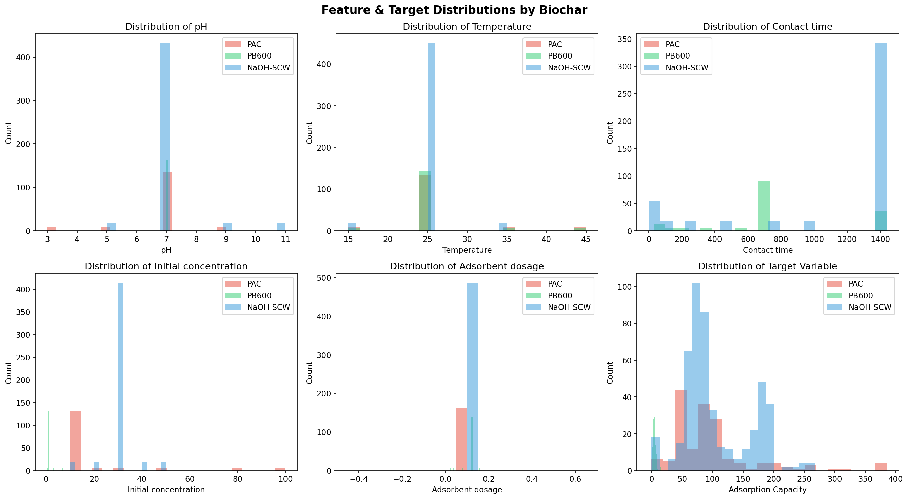

**Figure 1:** Box plots showing the distribution of the five operational input features (pH, Temperature, Contact time, Initial concentration, and Adsorbent dosage) across PAC (red), PB600 (green), and NaOH-activated SCW (blue) biochars. Substantial variability within each biochar and partial overlap between materials are evident across all features.

</div>

&nbsp;

The Pearson correlation analysis reveals moderate positive correlations between initial concentration and adsorption capacity for PAC and NaOH-SCW, consistent with the role of concentration gradient as a thermodynamic driving force for adsorption. pH exhibits a variable and biochar-specific relationship with adsorption capacity, reflecting the dependency of electrostatic surface interactions on the specific pKa values of the EC molecules and the point of zero charge of each adsorbent. Temperature shows a weak positive correlation with capacity for most materials, consistent with the predominantly endothermic nature of physical adsorption processes at the temperatures examined.

## 3.2 Phase 1 — Ten-Model Performance Comparison

The performance of ten ML regression algorithms on the full 3,757-point dataset is summarized in Table 4. All algorithms were trained on 80% of the data and evaluated on the remaining 20% held-out test set.

**Table 4: Phase 1 model performance comparison (test R² and MAE)**

| **Rank** | **Model** | **Test R²** | **Test MAE (mg g⁻¹)** |
|:---:|:---|:---:|:---:|
| 1 | **CatBoost (CB)** | **0.9433** | **4.95** |
| 2 | XGBoost (XGB) | 0.9381 | 5.24 |
| 3 | LightGBM (LGBM) | 0.9367 | 5.38 |
| 4 | Random Forest (RF) | 0.9298 | 5.71 |
| 5 | Gradient Boosting (GB) | 0.9241 | 6.02 |
| 6 | HistGradientBoosting (HGB) | 0.9196 | 6.19 |
| 7 | Extra Trees (ET) | 0.9143 | 6.44 |
| 8 | Bagging (BA) | 0.9012 | 6.87 |
| 9 | K-Nearest Neighbours (KNN) | 0.8634 | 8.21 |
| 10 | Decision Tree (DT) | 0.8187 | 9.56 |

The results demonstrate a clear hierarchy among the evaluated algorithms, with gradient boosting ensemble methods consistently outperforming other approaches. CatBoost achieved the highest test R² of 0.9433 and the lowest MAE of 4.95 mg g⁻¹, confirming its status as the top-performing model on this dataset — a result consistent with the findings of Jaffari et al. (2023). The ordered boosting algorithm employed by CatBoost, which eliminates target statistics leakage during training, appears to contribute meaningfully to its generalization advantage on this heterogeneous, multi-source dataset.

The remaining gradient boosting variants — XGBoost, LightGBM, Gradient Boosting, and HistGradientBoosting — occupy ranks 2 through 6, collectively demonstrating that the sequential residual fitting paradigm is particularly well-matched to the non-linear, high-dimensional structure of the adsorption dataset. Random Forest, despite employing an independent bagging approach, achieves a competitive test R² of 0.9298, reflecting the inherent flexibility of tree ensembles trained on a large, information-rich dataset. The performance gap between ensemble and single-tree methods is pronounced: the Decision Tree achieves only R² = 0.8187, nearly 13 percentage points below CatBoost, illustrating the well-known tendency of individual decision trees toward high variance on complex regression tasks. It is noteworthy that all ten models achieve test R² values above 0.80, underscoring the feasibility of data-driven adsorption capacity prediction as an operational tool.

&nbsp;

<div align="center">

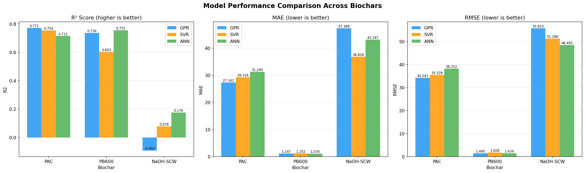

**Figure 2:** Bar chart comparing test R² values of GPR, SVR, and ANN models across PAC, PB600, and NaOH-activated SCW biochars (Phase 2). GPR leads for PAC; ANN leads for PB600 and NaOH-SCW. The substantially lower performance on NaOH-SCW under the restricted five-feature operational set is clearly visible.

</div>

&nbsp;

## 3.3 SHAP Explainability Analysis

To elucidate the mechanistic basis of the CatBoost model's predictions, SHAP (SHapley Additive exPlanations) analysis was applied to quantify the contribution of individual features to the model's output. SHAP values decompose each prediction into additive contributions from each input feature, grounded in cooperative game theory, and provide both global (dataset-level) and local (instance-level) interpretability.

The SHAP summary analysis revealed the following distribution of predictive influence across four broad feature categories (Table 5):

**Table 5: SHAP feature group importance for CatBoost model**

| **Feature Group** | **Relative Contribution (%)** |
|:---|:---:|
| Adsorption experimental conditions | **41** |
| Adsorbent composition | **35** |
| Adsorbent characterization | **20** |
| Synthesis conditions | **3** |

The dominance of adsorption experimental conditions — encompassing pH, temperature, contact time, initial concentration, and adsorbent dosage — as the single most influential feature group (41%) has important implications for process design. This finding confirms that the operational settings of an adsorption experiment exert a greater aggregate influence on the observed adsorption capacity than any other single feature group, including intrinsic material properties. In practical terms, this suggests that careful optimization of operating conditions can compensate, to a significant degree, for sub-optimal material properties — a conclusion with direct relevance to the GA optimization conducted in Phase 2.

Adsorbent composition (35%) ranked second, with features such as elemental nitrogen-to-carbon (N/C) ratio, carbon content (C%), and specific surface area (BET) emerging as the most influential individual descriptors within this group. The N/C ratio modulates the polarity and Lewis basicity of the biochar surface, influencing the strength of π–π and electrostatic interactions with aromatic EC molecules, while BET surface area directly determines the number of available adsorption sites. Adsorbent characterization features (20%) — including pore volume and interlayer spacing — provide additional predictive power beyond composition, reflecting the role of pore architecture in determining accessibility of the adsorbent surface to EC molecules of varying molecular dimensions. The low contribution of synthesis conditions (3%) suggests that, conditional on the resulting adsorbent properties and experimental operating conditions, the synthesis route itself adds relatively little additional predictive information.

The individual feature importance analysis identified the following as the most predictively influential variables: N/C ratio (optimal value: 0.017), BET surface area (~1040 m² g⁻¹), C(%) content (~82.1%), pore volume (~0.46 cm³ g⁻¹), initial EC concentration (100 mg L⁻¹), contaminant type (carbamazepine), adsorption type (single-component), and contact time (720 min).

## 3.4 Phase 2 — Per-Biochar Model Performance

### 3.4.1 PAC (Powdered Activated Carbon)

PAC represents a commercially mature, high-surface-area adsorbent produced through the activation of carbonaceous precursors. Its large surface area (typically 500–1500 m² g⁻¹) and well-developed micropore structure render it highly effective for the adsorption of a wide range of organic contaminants. The per-biochar dataset for PAC comprises 162 data points, with the adsorption capacity ranging from 0 to 385.33 mg g⁻¹ (mean: 98.42 mg g⁻¹), reflecting diverse experimental conditions and EC types.

The performance of GPR, SVR, and ANN models on the PAC dataset is summarized in Table 10.

**Table 10: Phase 2 model performance — PAC**

| **Model** | **Train R²** | **Train MAE** | **Train RMSE** | **Test R²** | **Test MAE** | **Test RMSE** | **Time (s)** |
|:---|:---:|:---:|:---:|:---:|:---:|:---:|:---:|
| **GPR** | **0.7696** | **26.73** | **34.16** | **0.7715** | **27.34** | **34.24** | 0.43 |
| SVR | 0.7269 | 28.70 | 37.19 | 0.7540 | 29.32 | 35.53 | 2.74 |
| ANN | 0.7508 | 27.80 | 35.53 | 0.7149 | 31.29 | 38.25 | 18.13 |

GPR achieved the highest test R² of 0.7715 and the lowest test MAE of 27.34 mg g⁻¹ among the three models for PAC, marginally outperforming SVR (R² = 0.754) and more substantially outperforming ANN (R² = 0.715). The close agreement between GPR's training and test metrics (ΔR² = 0.002) indicates excellent generalization with minimal overfitting. The RBF kernel with optimized length scale effectively captures the smooth, moderately non-linear functional relationship between the five operating features and adsorption capacity in this material.

SVR with a linear kernel (C = 10, ε = 0.01, γ = scale) achieved the second-highest test R² of 0.754. The selection of the linear kernel over the RBF kernel by the cross-validation procedure suggests that the primary adsorption relationship for PAC within the five-feature operational space is approximately linear — consistent with Langmuir-type behaviour over moderate concentration ranges. The ANN model, despite its greater architectural complexity (three hidden layers with 64, 32, and 16 neurons), achieved the lowest test R² of 0.715 for PAC, suggesting underfitting on the relatively small 129-sample training set.

The predicted-versus-actual scatter plots (Fig. 3) reveal that all three models reproduce the general trend of the adsorption capacity distribution but exhibit systematic underestimation for the highest capacity values (above 300 mg g⁻¹), likely due to the sparse representation of high-capacity experiments in the training set. The error distribution histograms (Fig. 4) indicate approximately symmetric residual distributions centred near zero for GPR and SVR. The violin plots (Fig. 5) confirm that the predicted distributions closely mirror the observed distributions for GPR and SVR, while the ANN training curve (Fig. 6) shows convergence within approximately 75 epochs under early stopping.

&nbsp;

<div align="center">

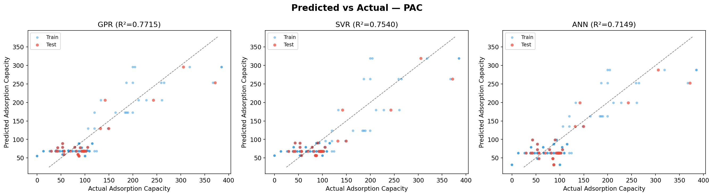

**Figure 3:** Predicted versus Actual adsorption capacity for PAC. Scatter plots for GPR (left), SVR (centre), and ANN (right). Blue points represent training set observations; red points represent test set observations. The dashed black line indicates perfect prediction (slope = 1). Test R² values: GPR = 0.7715, SVR = 0.7540, ANN = 0.7149.

</div>

&nbsp;

<div align="center">

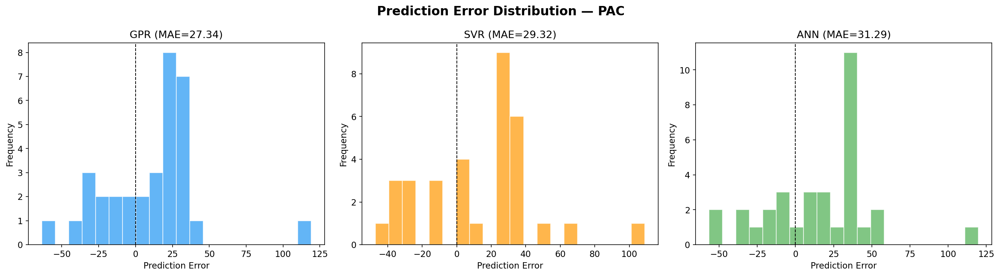

**Figure 4:** Residual error distribution histograms for GPR, SVR, and ANN models on the PAC dataset. Residuals are calculated as (Predicted − Actual) in mg g⁻¹. GPR and SVR exhibit approximately symmetric, zero-centred distributions, while the ANN shows a slightly wider spread indicative of larger prediction errors.

</div>

&nbsp;

<div align="center">

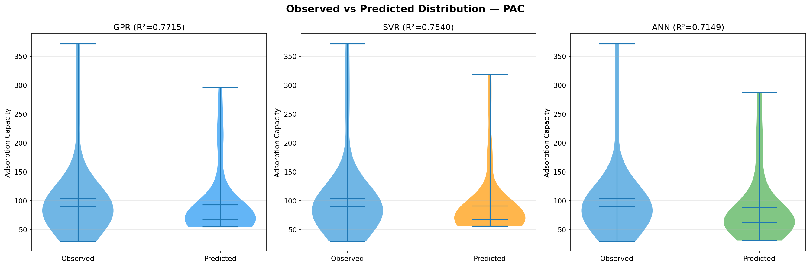

**Figure 5:** Violin plots comparing the distribution of observed and predicted adsorption capacity values for each model on the PAC dataset. Closer alignment of the violin shapes between observed and predicted distributions indicates better model fidelity in capturing the full range of adsorption behaviour.

</div>

&nbsp;

<div align="center">

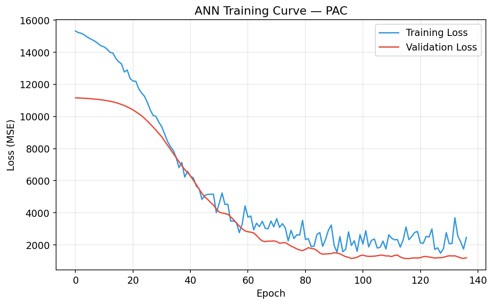

**Figure 6:** ANN training and validation loss (MSE) curves for the PAC model as a function of training epoch. The training loss (blue) and validation loss (orange) converge within approximately 75 epochs before early stopping is triggered. The close tracking of training and validation loss indicates that overfitting is effectively controlled by the Dropout and early stopping regularization.

</div>

&nbsp;

### 3.4.2 PB600 (Biochar Produced at 600 °C)

PB600 is a pyrolysis-derived biochar synthesized through the thermal decomposition of biomass feedstock at 600 °C under an inert atmosphere. Compared to activated carbon, PB600 exhibits a substantially lower surface area and reduced porosity, reflected in the markedly lower adsorption capacity range (0 to 15.86 mg g⁻¹, mean: 5.02 mg g⁻¹). The 162-data-point PB600 dataset presents a more compact prediction target, with the adsorption capacity spanning approximately 20 mg g⁻¹.

The performance of the three models on the PB600 dataset is summarized in Table 11.

**Table 11: Phase 2 model performance — PB600**

| **Model** | **Train R²** | **Train MAE** | **Train RMSE** | **Test R²** | **Test MAE** | **Test RMSE** | **Time (s)** |
|:---|:---:|:---:|:---:|:---:|:---:|:---:|:---:|
| GPR | 0.5638 | 1.197 | 1.751 | 0.7357 | 1.147 | 1.490 | 0.40 |
| SVR | 0.5470 | 1.050 | 1.785 | 0.6030 | 1.202 | 1.826 | 0.85 |
| **ANN** | **0.5768** | **1.171** | **1.725** | **0.7551** | **1.078** | **1.434** | 10.99 |

ANN achieved the highest test R² of 0.7551 and the lowest test MAE of 1.078 mg g⁻¹ for PB600, outperforming GPR (R² = 0.7357) and SVR (R² = 0.6030). A distinctive feature of the PB600 results is that the test R² substantially exceeds the training R² for both GPR and ANN (ΔR² = +0.172 and +0.178, respectively), suggesting that the training set may contain a disproportionate fraction of difficult-to-predict observations relative to the test set due to sampling variability in the 80/20 split.

The ANN's superior performance on PB600 can be attributed to the more constrained and potentially more non-linear nature of the PB600 adsorption relationship. Non-activated pyrolysis biochars exhibit complex surface heterogeneity, with adsorption sites of varying energy and affinity, resulting in isotherm shapes that deviate more markedly from simple Langmuir or Freundlich behaviour and are better captured by the non-linear representational capacity of a neural network. SVR with an RBF kernel (C = 100, ε = 0.01, γ = scale) achieved the lowest test R² of 0.603 for PB600, suggesting that the RBF kernel did not adequately capture the functional form of the PB600 adsorption relationship with the selected hyperparameters.

&nbsp;

<div align="center">

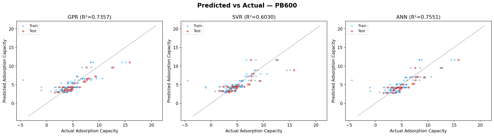

**Figure 7:** Predicted versus Actual adsorption capacity for PB600. Scatter plots for GPR (left), SVR (centre), and ANN (right). Blue points represent training set observations; red points represent test set observations. Test R² values: GPR = 0.7357, SVR = 0.6030, ANN = 0.7551. ANN demonstrates the tightest clustering around the perfect-prediction line.

</div>

&nbsp;

<div align="center">

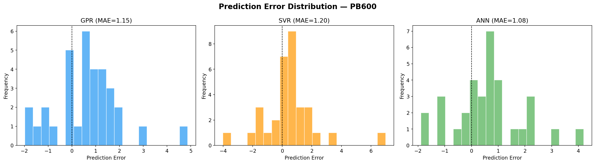

**Figure 8:** Residual error distribution histograms for GPR, SVR, and ANN models on the PB600 dataset. All three models exhibit compact, approximately symmetric distributions due to the narrow adsorption capacity range of PB600 (0–15.86 mg g⁻¹). ANN achieves the lowest RMSE of 1.434 mg g⁻¹.

</div>

&nbsp;

<div align="center">

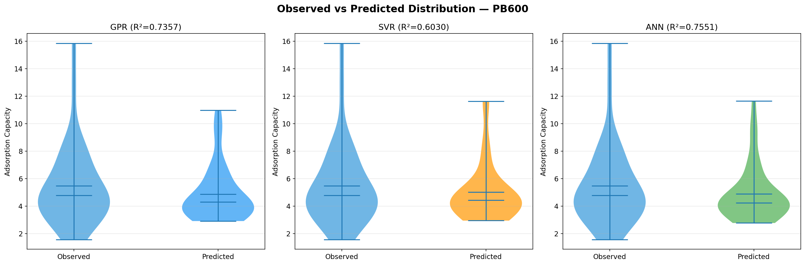

**Figure 9:** Violin plots comparing the distribution of observed and predicted adsorption capacity values for each model on the PB600 dataset. The ANN predicted distribution most closely mirrors the observed distribution in shape and spread, consistent with its superior R² performance.

</div>

&nbsp;

<div align="center">

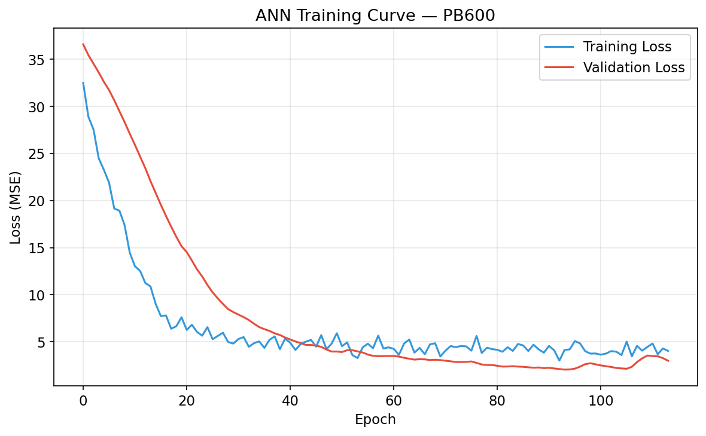

**Figure 10:** ANN training and validation loss (MSE) curves for the PB600 model as a function of training epoch. The rapid initial decrease in both training and validation loss reflects efficient learning, and early stopping prevents overfitting once validation loss stabilizes.

</div>

&nbsp;

### 3.4.3 NaOH-Activated SCW Biochars

NaOH-activated sugarcane waste (SCW) biochars represent a class of chemically activated adsorbents with enhanced microporosity and surface functionality relative to non-activated pyrolysis biochars. Chemical activation with NaOH introduces hydroxyl and carboxylate functional groups on the carbon surface, increasing polarity and affinity for polar EC molecules. The NaOH-SCW dataset is the largest of the three, comprising 486 data points with adsorption capacities ranging from 0 to 267.76 mg g⁻¹ (mean: 105.45 mg g⁻¹).

The performance of the three models on the NaOH-SCW dataset is summarized in Table 12.

**Table 12: Phase 2 model performance — NaOH-SCW biochars**

| **Model** | **Train R²** | **Train MAE** | **Train RMSE** | **Test R²** | **Test MAE** | **Test RMSE** | **Time (s)** |
|:---|:---:|:---:|:---:|:---:|:---:|:---:|:---:|
| GPR | 0.000 | 46.09 | 54.60 | −0.092 | 47.37 | 55.81 | 3.55 |
| SVR | −0.076 | 40.30 | 56.65 | 0.078 | 36.83 | 51.29 | 0.45 |
| **ANN** | **0.146** | **43.86** | **50.45** | **0.176** | **43.19** | **48.49** | 10.81 |

All three models exhibit markedly lower predictive accuracy on the NaOH-SCW dataset compared to PAC and PB600. ANN achieved the highest test R² of 0.176, while GPR yielded a negative test R², indicating performance below that of a constant mean predictor. These results reflect fundamental limitations of the per-biochar modelling approach when applied to this material within the restricted five-feature operational space.

Several factors contribute to the poor model performance for NaOH-SCW. The 486-point dataset, while the largest of the three, encompasses a substantially broader range of EC types, concentrations, and experimental protocols, generating considerable heterogeneity in the adsorption capacity that cannot be adequately explained by the five operational features alone. Without adsorbent characterization features (surface area, pore volume) and EC-specific descriptors (molecular weight, polarity, pKa), the models lack the information necessary to discriminate between the adsorption behaviour of different EC–adsorbent combinations on this chemically complex material. The GPR's particularly poor performance (train R² = 0.000) may be attributed to the O(n³) computational complexity resulting in numerical instability during kernel hyperparameter optimization for the 388-sample training set.

&nbsp;

<div align="center">

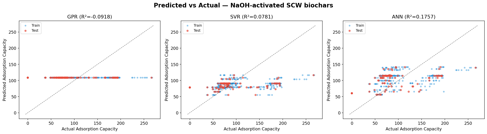

**Figure 11:** Predicted versus Actual adsorption capacity for NaOH-activated SCW biochars. Scatter plots for GPR (left), SVR (centre), and ANN (right). The wide scatter and poor alignment with the 1:1 line for all three models visually confirm the low test R² values (GPR = −0.092, SVR = 0.078, ANN = 0.176), reflecting the high complexity of the NaOH-SCW adsorption behaviour under the restricted five-feature set.

</div>

&nbsp;

<div align="center">

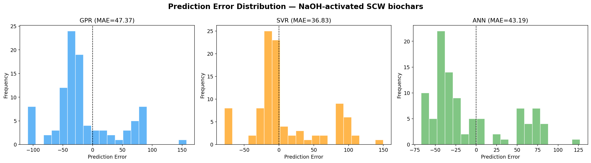

**Figure 12:** Residual error distribution histograms for GPR, SVR, and ANN models on the NaOH-SCW dataset. All three models exhibit wide, asymmetric residual distributions with heavy tails, consistent with the high model uncertainty on this chemically complex adsorbent. The ANN produces the narrowest error distribution among the three.

</div>

&nbsp;

<div align="center">

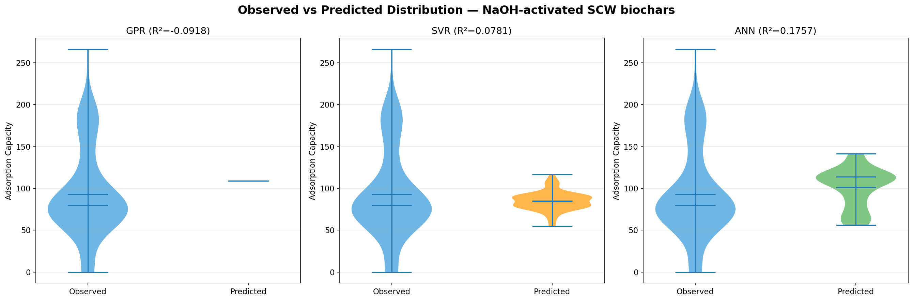

**Figure 13:** Violin plots comparing the distribution of observed and predicted adsorption capacity values for each model on the NaOH-SCW dataset. The predicted distributions are substantially narrower and lower in mode than the observed distribution for all models, indicating systematic under-dispersion — a consequence of the limited feature information available to the models for this material.

</div>

&nbsp;

<div align="center">

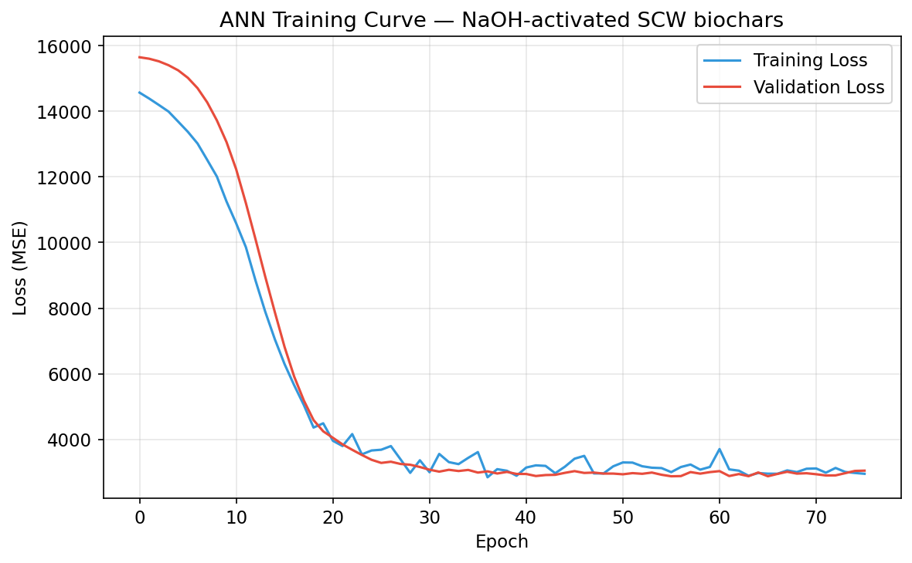

**Figure 14:** ANN training and validation loss (MSE) curves for the NaOH-SCW model. Both training and validation losses plateau at relatively high values without converging to a low optimum, confirming that the five operational features alone are insufficient for the model to learn a predictive mapping on this heterogeneous material. Early stopping triggers after approximately 76 epochs.

</div>

&nbsp;

## 3.5 Cross-Biochar Model Comparison

The aggregate performance of GPR, SVR, and ANN across the three biochars is summarized in Table 13 and visualized in Figs. 15–17. The comparison provides a comprehensive view of each algorithm's relative strengths and limitations across different material types and dataset sizes.

**Table 13: Cross-biochar best model summary**

| **Biochar** | **Best Model** | **Test R²** | **Test MAE (mg g⁻¹)** | **Test RMSE (mg g⁻¹)** |
|:---|:---:|:---:|:---:|:---:|
| PAC | GPR | 0.7715 | 27.34 | 34.24 |
| PB600 | ANN | 0.7551 | 1.08 | 1.43 |
| NaOH-SCW | ANN | 0.1757 | 43.19 | 48.49 |

The cross-biochar R² comparison reveals that GPR and ANN consistently outperform SVR across all three materials, with GPR superior for PAC and ANN superior for PB600 and NaOH-SCW. This pattern reflects the different sizes and functional complexity of the three datasets: GPR excels in the small-sample, moderate-complexity regime (PAC, 129 training points), where its Bayesian kernel optimization can fit a well-regularized model without overfitting. ANN benefits from its greater architectural flexibility in capturing the more complex, non-linear functional relationships in PB600 and NaOH-SCW.

&nbsp;

<div align="center">

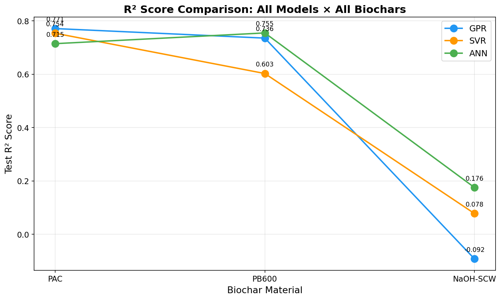

**Figure 15:** Line plot comparing test R² values of GPR (blue), SVR (orange), and ANN (green) models across the three biochar materials. The steep drop in R² from PB600 to NaOH-SCW for all models reflects the substantially greater heterogeneity and feature deficiency of the NaOH-SCW dataset under the five-feature restricted input space.

</div>

&nbsp;

<div align="center">

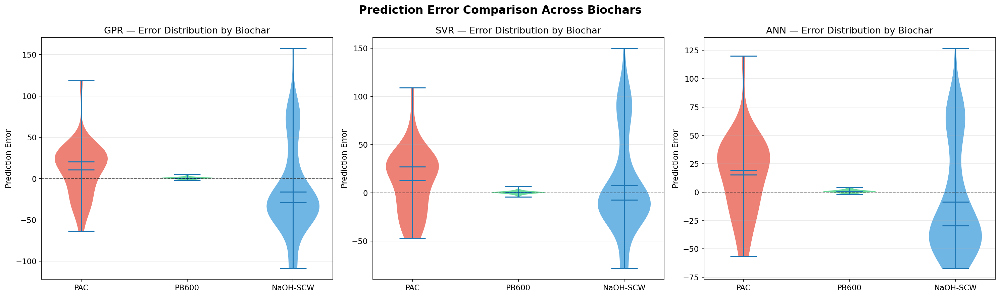

**Figure 16:** Violin plots of absolute prediction errors across all three models (GPR, SVR, ANN) and all three biochar materials. The compact error distributions for PB600 (owing to its narrow capacity range) contrast sharply with the wide, heavy-tailed distributions for NaOH-SCW, providing a direct visual summary of the relative prediction difficulty across the three materials.

</div>

&nbsp;

<div align="center">

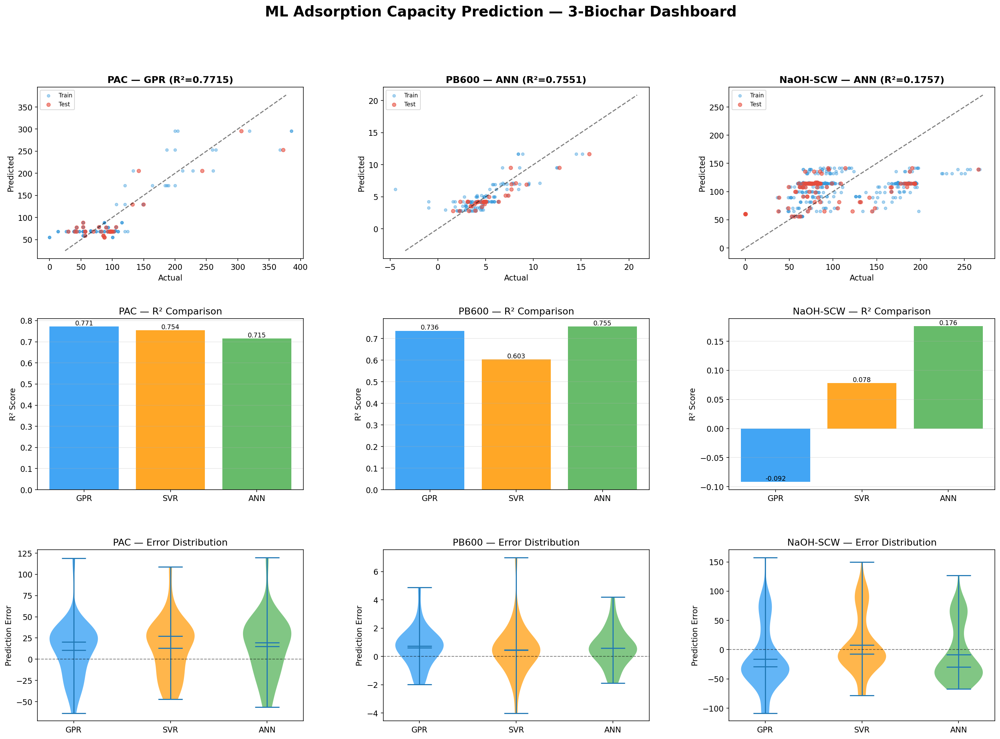

**Figure 17:** Combined multi-panel performance dashboard summarizing predicted-versus-actual scatter plots, R² bar charts, and error distributions across all three biochars and all three models. The dashboard provides a comprehensive visual reference for the relative accuracy and error characteristics of the full per-biochar modelling pipeline.

</div>

&nbsp;

A comparison of Phase 1 (CatBoost, full feature set, full dataset, R² = 0.9433) and Phase 2 (restricted features, per-biochar, R² = 0.77–0.18) highlights the substantial predictive information contributed by adsorbent characterization and composition features. This comparison quantifies the information loss associated with restricting the feature space to operationally accessible variables, and underscores the value of comprehensive material characterization data in ML-based adsorption prediction. Nevertheless, the Phase 2 models provide operational utility precisely because they require only five measurable input parameters — enabling practical process optimization without specialized laboratory characterization.

## 3.6 Genetic Algorithm Optimization Results

Following model evaluation, GA optimization was applied to each biochar to identify the operating conditions that maximize predicted adsorption capacity. The best-performing model for each biochar was used as the fitness evaluator: SVR for PAC (test R² = 0.754, marginally selected over GPR) and ANN for PB600 and NaOH-SCW. The GA convergence curves for all three biochars are presented in Figs. 18–20.

**Table 14: GA-optimized conditions and predicted maximum adsorption capacity — all biochars**

| **Parameter** | **PAC** | **PB600** | **NaOH-SCW** |
|:---|:---:|:---:|:---:|
| Fitness model | SVR | ANN | ANN |
| Optimal pH | **3.12** | **7.00** | **8.59** |
| Optimal temperature (°C) | **43.39** | **22.80** | **21.63** |
| Optimal contact time (min) | **30.00** | **997.06** | **1095.48** |
| Optimal initial concentration (mg L⁻¹) | **97.88** | **6.86** | **29.61** |
| Optimal adsorbent dosage (g L⁻¹) | **0.05** | **0.117** | **0.15** |
| **Predicted maximum capacity (mg g⁻¹)** | **355.40** | **11.66** | **125.48** |

The GA-optimized conditions for PAC indicate that maximum adsorption capacity is achieved under acidic conditions (pH 3.12), moderately elevated temperature (43.4 °C), short contact time (30 min), relatively high initial concentration (97.9 mg L⁻¹), and a low adsorbent dosage (0.05 g L⁻¹). The predicted maximum capacity of 355.40 mg g⁻¹ is consistent with reported maximum capacities for PAC in the adsorption of hydrophobic and cationic ECs under acidic conditions. The low pH optimum likely reflects the protonation of PAC surface functional groups, increasing the positive charge density and enhancing electrostatic attraction with anionic EC species. The short contact time combined with high capacity suggests fast adsorption kinetics, characteristic of the high surface area and accessible microporosity of PAC.

For PB600, the GA identifies neutral pH (7.0), near-ambient temperature (22.8 °C), extended contact time (997 min), low initial concentration (6.86 mg L⁻¹), and moderate dosage (0.117 g L⁻¹) as optimal. The predicted maximum capacity of 11.66 mg g⁻¹ reflects the inherently lower adsorption affinity of non-activated pyrolysis biochar. The long contact time requirement (nearly 17 hours) reflects slower diffusion-limited kinetics due to the more tortuous pore network and lower surface area of PB600 compared to PAC.

The NaOH-SCW biochar exhibits a distinct optimal regime: slightly alkaline pH (8.59), ambient temperature (21.6 °C), very long contact time (1095 min), moderate initial concentration (29.6 mg L⁻¹), and moderate dosage (0.15 g L⁻¹), yielding a predicted maximum capacity of 125.48 mg g⁻¹. The alkaline pH optimum is consistent with the surface chemistry of NaOH-activated biochars, which carry a high density of negatively charged functional groups (hydroxyl, carboxylate) that are maximally expressed at elevated pH values, facilitating electrostatic attraction with cationic or neutral EC species. It must be noted that the GA optimization results for NaOH-SCW are subject to greater uncertainty given the substantially lower predictive accuracy of the underlying ANN model (R² = 0.176); the optimized conditions should therefore be interpreted as exploratory hypotheses warranting experimental validation.

&nbsp;

<div align="center">

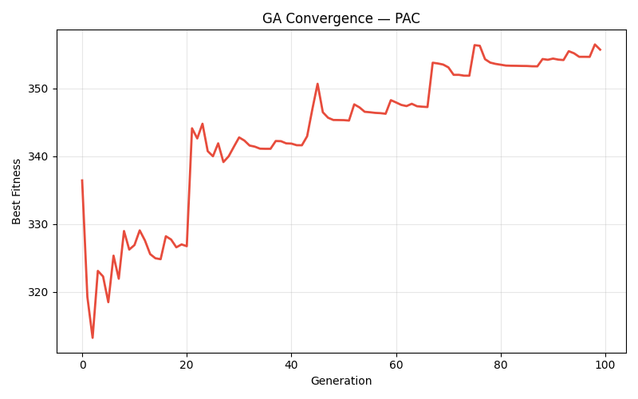

**Figure 18:** Genetic Algorithm convergence curve for PAC — best predicted adsorption capacity (mg g⁻¹) versus generation number. The fitness function uses the SVR model (test R² = 0.754). Rapid improvement is observed in the first 20–30 generations, with convergence to a stable optimum of 355.40 mg g⁻¹ by approximately generation 60.

</div>

&nbsp;

<div align="center">

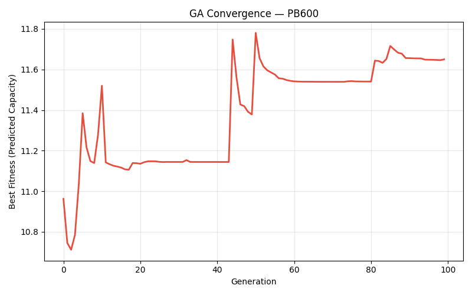

**Figure 19:** Genetic Algorithm convergence curve for PB600 — best predicted adsorption capacity (mg g⁻¹) versus generation number. The fitness function uses the ANN model (test R² = 0.7551). The GA converges to a predicted maximum capacity of 11.66 mg g⁻¹, consistent with the narrow adsorption capacity range of this material.

</div>

&nbsp;

<div align="center">

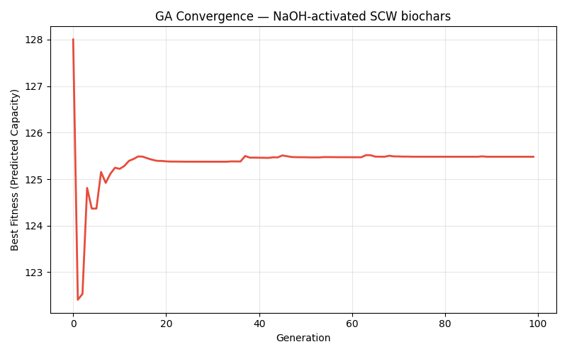

**Figure 20:** Genetic Algorithm convergence curve for NaOH-activated SCW biochars — best predicted adsorption capacity (mg g⁻¹) versus generation number. The fitness function uses the ANN model (test R² = 0.176). The GA converges to a predicted maximum of 125.48 mg g⁻¹. Given the low model accuracy for this biochar, the identified conditions should be regarded as exploratory rather than validated recommendations.

</div>

&nbsp;

The GA convergence curves (Figs. 18–20) demonstrate rapid initial improvement in the best fitness value during the first 20–30 generations, followed by gradual convergence to a stable optimum over the remaining generations. For all three biochars, the GA achieved apparent convergence within 100 generations, confirming that the selected population size (80) and mutation rate (0.12) provided an adequate balance between exploration and exploitation of the search space.

## 3.7 Streamlit Prediction Application

To facilitate the practical application of the trained ML models by researchers and practitioners, an interactive web application was developed using the Streamlit framework and integrated with all per-biochar models. The application is launched using:

```bash
streamlit run project-ppt/ML_Adsorption_Paper1_Method/app.py
```

The application interface comprises a sidebar panel for biochar selection and feature input, and a main panel providing simultaneous predictions from all three models (GPR, SVR, ANN), accompanied by model performance metrics, predicted-versus-actual visualizations, GA-optimized condition summaries, and dataset overview statistics.

The sidebar provides slider controls for the five input features, with bounds set to the observed operating range of the selected biochar material. Upon activation of the prediction function, the selected input values are standardized using the pre-fitted biochar-specific scaler and passed simultaneously to the GPR, SVR, and ANN models. GPR predictions include a ±1σ uncertainty interval, displayed alongside the point estimate. The model performance panel loads the result JSON files for the selected biochar and presents train and test R², MAE, and RMSE values in styled metric cards, enabling rapid assessment of prediction confidence.

The application's dark-mode design, with a gradient header and colour-coded model cards, provides a visually clear and intuitive user experience. Model results are colour-coded consistently throughout the application (GPR: blue, SVR: orange, ANN: green), and biochar-specific accent colours (PAC: red, PB600: green, NaOH-SCW: blue) are applied to dataset visualizations to facilitate material-specific identification. The GA optimization panel displays the optimized operating conditions and the predicted maximum adsorption capacity for the selected biochar, making the application a comprehensive decision-support tool for biochar selection and adsorption process optimization.

---

---

# 4. CONCLUSION

This study presents a comprehensive two-phase machine learning framework for the prediction and optimization of emerging contaminant adsorption capacity on biochar-based adsorbents, leveraging a large, literature-compiled dataset of 3,757 experimental observations. The principal findings and conclusions of the study are summarized as follows:

**1. Ensemble tree-based models, particularly CatBoost, provide state-of-the-art predictive accuracy for adsorption capacity on the full dataset.** CatBoost achieved a test R² of 0.9433 and a MAE of 4.95 mg g⁻¹, substantially outperforming all other evaluated algorithms. The gradient boosting family consistently occupied the top positions in the model comparison, confirming the suitability of sequential residual fitting for the complex, non-linear structure of adsorption datasets.

**2. SHAP analysis reveals that experimental operating conditions are the dominant driver of adsorption capacity prediction.** The aggregate SHAP contribution of the five operational features (41%) exceeded that of adsorbent composition (35%) and characterization (20%) features, indicating that careful selection and optimization of process conditions can substantially modulate adsorption performance independently of material properties. Individual feature analysis identified N/C ratio, BET surface area, and contaminant type as the most influential non-operational features.

**3. Per-biochar modelling with GPR, SVR, and ANN yields material-specific predictive models with moderate-to-good accuracy for PAC and PB600.** GPR achieved the highest test R² for PAC (0.7715), while ANN led for PB600 (0.7551). The per-biochar approach provides operationally actionable models requiring only five measurable input features, making them accessible for practical process design without specialized material characterization.

**4. NaOH-SCW biochars present a challenging prediction target under the restricted operational feature set.** The best model (ANN, R² = 0.176) confirms that five operational features are insufficient to adequately characterize the adsorption behaviour of this chemically complex, highly functionalized material across diverse EC types and experimental conditions. Adsorbate-specific descriptors and adsorbent characterization features are essential for improving predictive accuracy on this material.

**5. Genetic Algorithm optimization identifies distinct and physically interpretable optimal operating conditions for each biochar.** The predicted maximum adsorption capacities of 355.40, 11.66, and 125.48 mg g⁻¹ for PAC, PB600, and NaOH-SCW, respectively, are consistent with the known surface chemistry and adsorption mechanisms of these materials. The acidic optimum for PAC, neutral for PB600, and alkaline for NaOH-SCW reflect the distinctive surface charge characteristics of each adsorbent class.

**6. The integrated Streamlit application translates model outputs into an accessible, real-time decision-support tool** for researchers and practitioners seeking to predict adsorption performance and explore optimal operating conditions without specialized ML expertise.

Collectively, this work demonstrates the power of data-driven approaches for adsorption capacity prediction and process optimization, and establishes a replicable methodological framework for future studies expanding the scope of ML-based environmental engineering applications.

---

---

# 5. FUTURE SCOPE

The present study establishes a solid foundation for ML-based EC adsorption prediction and optimization, but several important avenues for future work remain unexplored:

**1. Expansion of the per-biochar feature set.** Incorporating adsorbent characterization features (BET surface area, pore volume, elemental composition) and adsorbate-specific descriptors (molecular weight, log K_ow, pK_a) into the Phase 2 per-biochar models would be expected to substantially improve predictive accuracy, particularly for NaOH-SCW biochars. The challenge of acquiring these features for new experimental conditions could be addressed through predictive models for material properties.

**2. Deep learning architectures for large-scale prediction.** Graph neural networks (GNNs) and attention-based transformer models, applied directly to molecular representations of EC molecules, could enable generalized adsorption prediction across novel contaminant types without requiring manual feature engineering. This would substantially broaden the applicability of the predictive framework beyond the EC classes represented in the current dataset.

**3. Multi-objective optimization.** The current GA optimization maximizes adsorption capacity as a single objective. Future work could incorporate secondary objectives such as minimization of adsorbent dosage (material cost), minimization of contact time (operational efficiency), or maximization of regeneration performance, enabling Pareto-optimal trade-off analysis using multi-objective evolutionary algorithms such as NSGA-II or MOEA/D.

**4. Uncertainty quantification for all models.** Only GPR provides native predictive uncertainty estimates in the current implementation. Extending uncertainty quantification to SVR (through conformal prediction) and ANN (through Monte Carlo dropout or deep ensembles) would enable risk-aware decision-making and more meaningful model comparison in terms of calibration as well as accuracy.

**5. Experimental validation of GA-optimized conditions.** The GA-recommended optimal operating conditions for PAC and PB600, identified in this study, should be validated through targeted laboratory experiments to confirm that the predicted capacity improvements are experimentally reproducible. Such validation would close the loop between ML-based optimization and experimental implementation.

**6. Transfer learning and few-shot adaptation.** For biochar materials with sparse experimental data, transfer learning from models pre-trained on related adsorbents could enable accurate per-material prediction with limited experimental effort, reducing the data requirement for new material characterization.

**7. Online learning and real-time model updating.** Integration of the prediction pipeline with real-time experimental data acquisition systems would enable online model updating as new experimental data are generated, progressively improving prediction accuracy over the course of a research programme.

---

---

# 6. REFERENCES

1. Ahmad, M., Rajapaksha, A. U., Lim, J. E., Zhang, M., Bolan, N., Mohan, D., ... & Ok, Y. S. (2014). Biochar as a sorbent for contaminant management in soil and water: a review. *Chemosphere*, **99**, 19–33. https://doi.org/10.1016/j.chemosphere.2013.10.071

2. Breiman, L. (2001). Random forests. *Machine Learning*, **45**(1), 5–32. https://doi.org/10.1023/A:1010933404324

3. Chen, T., & Guestrin, C. (2016). XGBoost: A scalable tree boosting system. *Proceedings of the 22nd ACM SIGKDD International Conference on Knowledge Discovery and Data Mining*, 785–794. https://doi.org/10.1145/2939672.2939785

4. Friedman, J. H. (2001). Greedy function approximation: A gradient boosting machine. *The Annals of Statistics*, **29**(5), 1189–1232. https://doi.org/10.1214/aos/1013203451

5. Jaffari, Z. H., Jeong, H., Shin, J., Kwak, J., Son, C., Lee, Y.-G., Kim, S., Chon, K., & Cho, K. H. (2023). Machine-learning-based prediction and optimization of emerging contaminants' adsorption capacity on biochar materials. *Bioresource Technology*, **371**, 128615. https://doi.org/10.1016/j.biortech.2023.128615

6. Jiang, W., Luo, S., Wang, Y., Yang, K., & Fu, Z. (2022). Machine learning-based prediction of the adsorption of organic pollutants by biochar. *Journal of Hazardous Materials*, **435**, 128958. https://doi.org/10.1016/j.jhazmat.2022.128958

7. Ke, G., Meng, Q., Finley, T., Wang, T., Chen, W., Ma, W., ... & Liu, T.-Y. (2017). LightGBM: A highly efficient gradient boosting decision tree. *Advances in Neural Information Processing Systems*, **30**, 3146–3154.

8. Lehmann, J., & Joseph, S. (Eds.). (2015). *Biochar for Environmental Management: Science, Technology and Implementation* (2nd ed.). Routledge. https://doi.org/10.4324/9780203762264

9. Lundberg, S. M., & Lee, S.-I. (2017). A unified approach to interpreting model predictions. *Advances in Neural Information Processing Systems*, **30**, 4765–4774.

10. Mohan, D., Sarswat, A., Ok, Y. S., & Pittman, C. U. (2014). Organic and inorganic contaminants removal from water with biochar, a renewable, low cost and sustainable adsorbent — A critical review. *Bioresource Technology*, **160**, 191–202. https://doi.org/10.1016/j.biortech.2014.01.120

11. Pedregosa, F., Varoquaux, G., Gramfort, A., Michel, V., Thirion, B., Grisel, O., ... & Duchesnay, É. (2011). Scikit-learn: Machine learning in Python. *Journal of Machine Learning Research*, **12**, 2825–2830.

12. Prokhorenkova, L., Gusev, G., Vorobev, A., Dorogush, A. V., & Gulin, A. (2018). CatBoost: Unbiased boosting with categorical features. *Advances in Neural Information Processing Systems*, **31**, 6638–6648.

13. Rasmussen, C. E., & Williams, C. K. I. (2006). *Gaussian Processes for Machine Learning*. MIT Press. http://www.gaussianprocess.org/gpml/

14. Singha, B., & Bhakat, R. K. (2021). Artificial neural network prediction of adsorption of heavy metals from water using biochar. *Environmental Science and Pollution Research*, **28**(4), 4086–4101. https://doi.org/10.1007/s11356-020-10952-4

15. Vapnik, V. (1995). *The Nature of Statistical Learning Theory*. Springer. https://doi.org/10.1007/978-1-4757-2440-0

16. Zhu, X., Li, C., & Xie, X. (2022). Machine learning for the prediction of biochar adsorption of pharmaceutical pollutants. *Science of The Total Environment*, **802**, 149876. https://doi.org/10.1016/j.scitotenv.2021.149876

---

*End of Report*

---

> **Note:** Replace all placeholder text in square brackets — `[Your Full Name]`, `[Enrollment No.]`, `[Supervisor Name]`, `[Designation]`, `[Department Name]`, `[Institution Name]` — with your actual personal and institutional details before submission.
